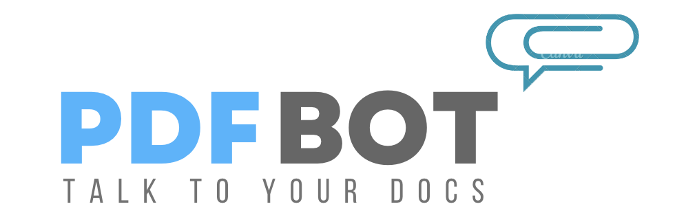

  

&nbsp;&nbsp;&nbsp;&nbsp;&nbsp;&nbsp;&nbsp;&nbsp;&nbsp;&nbsp;&nbsp;&nbsp;&nbsp;&nbsp;&nbsp;&nbsp;&nbsp;&nbsp;&nbsp;

## Quick Links

• [Deployed Site](https://gpt-pdf-chatbot.vercel.app/) • [PineconeDB Tutorial](https://www.pinecone.io/learn/context-aware-chatbot-with-vercel-ai-sdk/) •

 

# What is this chatbot for?

Current chat bots, such as GPT, either suffer from out-dated data, or they can 'hallucinate' answers irrelevant to the question and context. PDFBot is a web app designed to upload research papers, documentation, or even books to use as the context underlying any conversations with ChatGPT. 

This is a proof of concept and learning opportunity on how to leverage existing libraries, packages and techniques to built an AI Bot, using Retrieval-Augmented Generation (RAG). 

# 👨‍💻 Tech stack

This project is a complete client-side application, with a reliance on serverless technologies rather than a dedicated server. This project has been hosted using [Vercel](https://vercel.com), as it is accessible and free to host any web apps. 

 

Frontend

-   This project uses the [React Library](https://react.dev/) with [Next.js](https://nextjs.org/docs) as the development environment.
-   [Shadcn/UI](https://ui.shadcn.com/docs) for components, as it allows installation of single components without the need for dependencies.
-   [Tailwind](https://tailwindcss.com/docs/installation) has been used to customise components and elements, with a custom colour scheme from [hypercolor](https://hypercolor.dev/) gradient generator.
-   Edge Runtime: https://nextjs.org/docs/pages/api-reference/edge

 

Serverless

-   PineconeDB: https://docs.pinecone.io/docs/overview
-   S3 Bucket: https://aws.amazon.com/s3/
-   Clerk Auth: https://clerk.com/docs
-   NeonDB: https://neon.tech/docs/guides/nextjs
-   Stripe: https://vercel.com/guides/getting-started-with-nextjs-typescript-stripe
  

# 🌟 What's next?!

This is version 1.0 of this chatbat. My intention is to further build on top of this and to further refine my understanding and development for fullstack applications and generative AI. As part of this, my current goals for this project is as follows:

-   Unit test
-   Component Library
-   Deletion of chats
-   Manage your PDFs

This is a lot to add in terms of further steps, but I would like this to be a good example of code and approaches to be used by others. :D

## Useful Articles, Videos and Links

#### Retrieval-Augmented Generation
- What is RAG?: https://www.youtube.com/watch?v=T-D1OfcDW1M

- https://sdk.vercel.ai/docs
- https://www.youtube.com/watch?v=ySus5ZS0b94

---

### Implementation 
- Package.json has script to expand the space size to be 8GB of Ram to stop running out of heap memory for devices that have memory issues.

### Why is this not tested?
This piece of work has not been unit tested as of now, but code coverage and unit tests will be addressed once an opportunity arises for me to focus on it. I am intending to further work on this with learnings and improvements as highlighted in the stretch goals above.

---

## Pathways into Tech?

I was very fortunate enough to have done the [Code First Girls](https://codefirstgirls.com/courses/cfgdegree/) Bootcamp with an opportunity to interview at an amazing company. Before then, I undertook a lot of web development courses, such as the FreeCodeCamp Legacy and Updated Web Dev courses, the Full-stack Route on Codecademy, and a ton of YouTube tutorials and Medium Articles!

My focus has been on project-based learning and undertaking Computer Science fundamentals. I have a ton more content on my TikTok on my own experience and journey, so feel free to connect on there!

## ✍️ Contributing

If you would like to contribute feedback, improvements or make your own version - this code is available for you to clone and use for your own projects and developments.

## ⚠️ License

My code is free and open-source under the GNU General Public License v3.0.